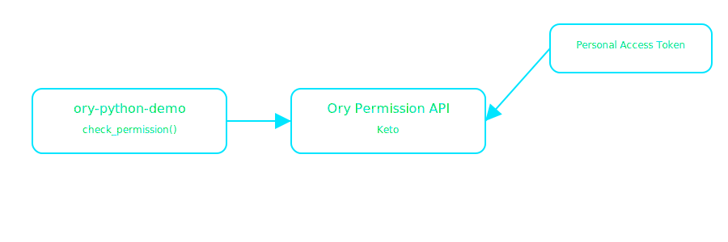

# ory-python-demo

Minimal Python demo that calls the Ory Permission API to check access for a subject on an object in a namespace.

## What it does
- Uses `ory-client` with `ORY_BASE_URL` and personal access token `ORY_TOKEN`
- Calls `check_permission` with `namespace`, `object`, `relation`, `subject_id`
- Prints the decision result

## Requirements
- Python 3.10+
- Ory account and a Personal Access Token (PAT)

## Authentication
- Create a PAT in the Ory Console under Account → Personal Access Tokens
- Copy the token and set it as `ORY_TOKEN` in your shell

## Environment variables
- `ORY_BASE_URL` (default: `https://playground.projects.oryapis.com`)
- `ORY_TOKEN` (required)

## Quickstart (no venv, throwaway)
    pip install --user ory-client
    export ORY_BASE_URL=https://playground.projects.oryapis.com
    export ORY_TOKEN=<personal_access_token>
    python check_permission.py --namespace docs --object page:123 --relation viewer --subject user:alice --max-depth 1

## Project files
- `check_permission.py`
- `docs/ory-python-demo-architecture.svg`

## Diagram

## License
MIT
